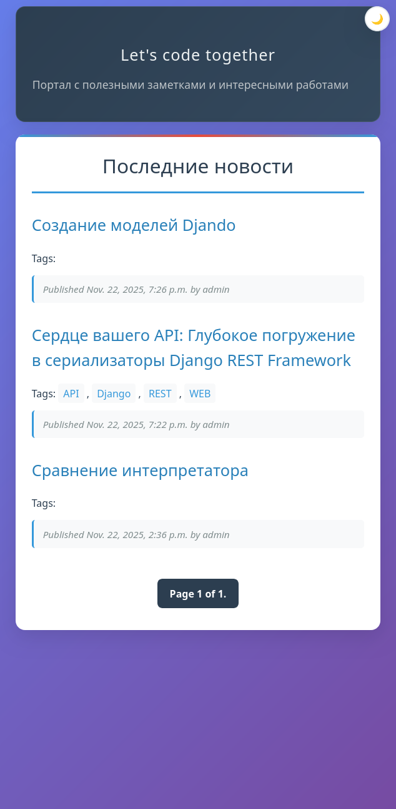

# blog
Приложени-блог для личного использования.
Возможности:
- [x] Создание и публикация постов и полезных материалов.
- [x] MinIO для хранения статики и всех файлов(например исходников программ из материалов).
- [x] Postgres в качестве основной базы даннъх.
- [x] Gunicorn в качестве сервера.



## Начало работы с проектом
1. Склонируйте репозиторий
2. Настройте свой локальный .env фал
- `.env.example` содержит все нужные поля
- `.env.dev` Служит для поднятия в локальной среде `decker-compose` нескольких контейнеров в связке.
3. Запустите проект:
```
podman-compose --env-file .env.dev up --build
```
или
```
docker-compose --env-file .env.dev up --build
```
